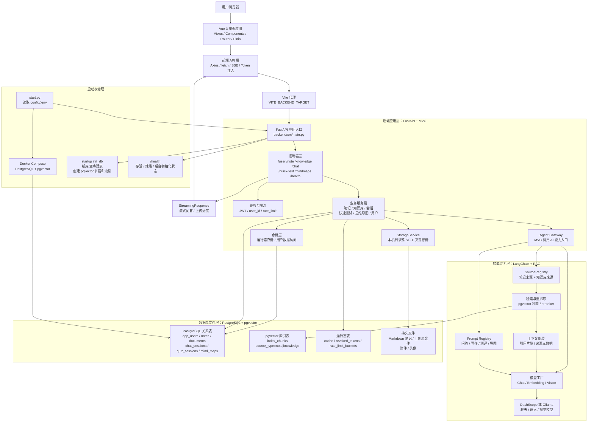

# 云笺集智能笔记与知识库系统项目概述

适用场景：课程答辩或项目评审开场的项目概述环节。  
建议时长：约 5 分钟。  
汇报视角：项目总负责人。  
表达重点：技术创新与工程落地。

## 一、项目概述应介绍的内容

- 项目背景：学习、科研和知识管理中存在资料分散、检索效率低、笔记复用率低、学习效果难验证等问题。
- 项目定位：云笺集 / RAGNotebook 改进版不是单一 RAG 问答 Demo，而是面向个人学习和知识复用的智能笔记与知识库工作台。
- 核心目标：打通资料沉淀、语义检索、AI 问答、快速测试和结构化输出，形成完整学习闭环。
- 核心功能：笔记管理、知识库上传、RAG 问答、AI 写作辅助、快速测试、思维导图生成。
- 技术架构：前端采用 Vue 3 + TypeScript + Vite，后端采用 FastAPI，数据库采用 PostgreSQL + pgvector，模型侧支持 DashScope / Ollama。
- 技术创新：统一关系数据和向量数据，统一笔记与知识库索引，按 `user_id` 做数据隔离，支持多源 RAG、NotebookLM 风格快速测试和导图生成。
- 负责人贡献：完成需求拆解、架构选型、任务分工、开发协调、质量验收、文档维护和演示闭环。
- 项目成果：系统可本地启动、核心功能可演示、接口和开发文档完整，具备继续扩展和维护的基础。

## 二、5 分钟演讲大纲

1. 开场定位：说明系统要解决“知识难沉淀、难检索、难复用”的问题。
2. 背景与需求：从学习资料、笔记、问答、复盘分散的问题引出建设必要性。
3. 总体架构：概括前端、后端、数据库、向量检索和模型服务之间的关系。
4. 核心创新：重点讲统一数据底座、多源 RAG、快速测试和思维导图。
5. 功能闭环：用“上传资料、写笔记、问答、测试、导图复盘”的流程说明用户价值。
6. 负责人统筹：说明自己如何把需求、架构、分工、测试和文档串起来。
7. 总结收束：强调项目从 RAG Demo 升级为可运行、可演示、可扩展的智能知识管理系统。

## 三、详细技术架构图

答辩讲解时可以按三条主线说明：

- 访问链路：用户从 Vue 3 前端进入系统，前端统一封装 API、登录 Token 和 SSE 流式响应，再通过 Vite 代理访问 FastAPI。
- 智能链路：业务服务通过 Agent Gateway 调用 RAG 能力，统一检索笔记和知识库来源，经过 pgvector 检索、重排序、Prompt 组装后调用 DashScope 或 Ollama。
- 数据治理链路：PostgreSQL 同时承载关系数据、运行态数据和 pgvector 向量索引，所有用户数据和向量检索都以 `user_id` 作为隔离边界。
- 启动运维链路：`start.py` 统一读取 `config/.env`，启动数据库、后端和前端；后端 startup 只支持新库/空库，并通过 `/health` 暴露就绪状态。

## 四、完整演讲稿

各位老师好，我是本项目的总负责人。接下来我先对我们的项目做一个整体概述。我们的项目名称是“云笺集”，它是基于 RAGNotebook 二次开发的智能笔记与知识库系统。我们做这个项目的出发点，是希望解决学习、科研和资料管理中一个很常见的问题：资料越来越多，但真正能够被检索、复习和复用的内容并不多。

在实际使用场景中，用户往往会把 PDF、Word、PPT、Markdown 文档、课堂笔记和问答记录分散保存在不同工具里。传统关键词搜索只能找到字面匹配内容，无法很好理解语义；笔记写完以后也经常停留在“保存”阶段，缺少自动测验、反馈和结构化整理机制。因此，我们把项目定位为一个智能笔记与个人知识库工作台，而不是只做一个简单的 RAG 问答 Demo。

围绕这个定位，我们设定的核心目标是打通一个完整的学习闭环：首先让用户能够沉淀资料和笔记，然后通过语义检索和 RAG 问答找到知识，再通过快速测试验证掌握情况，最后用思维导图把内容结构化输出。也就是说，系统不只是回答问题，而是帮助用户完成从资料管理到知识复用的全过程。

从功能上看，项目主要包括六个模块。第一是笔记管理，支持创建、编辑、分类、标签、搜索和导出；第二是知识库管理，支持多格式文件上传、解析、切片和预览；第三是 RAG 问答，可以结合笔记和知识库生成回答；第四是 AI 写作辅助，包括补全、续写、扩写、摘要和关联推荐；第五是快速测试，可以生成问答、评分反馈和总结；第六是思维导图，可以把来源内容转换成可交互的树状结构。

在技术架构上，我们采用前后端分离设计。前端使用 Vue 3、TypeScript、Vite、Pinia 和 Vue Router，负责页面交互、登录态管理、流式问答展示和导图渲染。后端使用 FastAPI 和 SQLAlchemy Async，按分层方式组织业务代码。数据底座采用 PostgreSQL，并通过 pgvector 承载知识库切片和笔记内容的向量索引。模型层支持 DashScope 和 Ollama，便于在云端模型和本地模型之间切换。

本项目的一个重要创新，是把关系数据、向量数据和运行态数据统一放到 PostgreSQL 体系中管理。用户、笔记、知识库文档、聊天会话、快速测试、思维导图、缓存、限流和 Token 撤销都有明确边界；笔记和知识库内容统一写入 `index_chunks`，并且所有关系查询和向量检索都带有 `user_id`。相比普通 RAG Demo，系统不只是能问答，还具备更清晰的数据治理和扩展能力。

第二个创新点是多源 RAG 与学习场景结合。系统不仅能对上传的知识库文件做检索，还能把用户自己的笔记纳入同一套索引，因此回答可以同时参考外部资料和个人沉淀内容。在此基础上，我们进一步实现了 NotebookLM 风格的快速测试，让用户在学完资料后可以自动生成题目、提交答案、获得反馈并形成总结；思维导图模块则把文本资料转化为结构化图谱，帮助用户快速复盘知识框架。

作为项目总负责人，我主要负责把这些能力组织成一个可交付的项目。我先完成需求拆解和模块边界设计，确定项目从单一问答能力升级为完整学习闭环；随后协调前端、后端、AI 能力和测试工作，推动数据库、接口、页面和模型链路同步落地；最后统一维护 README、开发者指南、排错文档、接口快照和演示流程，保证项目能启动、演示、验收和继续维护。

目前，云笺集已经具备本地一键启动、用户登录鉴权、笔记管理、知识库上传、RAG 问答、AI 写作辅助、快速测试、思维导图和健康检查等能力。整体来看，这个项目的价值在于把 RAG 技术从单点问答扩展到了真实学习流程中，并通过 Vue 3、FastAPI、PostgreSQL 和 pgvector 建立了较完整的工程化基础。接下来我将结合系统页面和核心流程，进一步展示这些功能是如何在项目中落地的。
