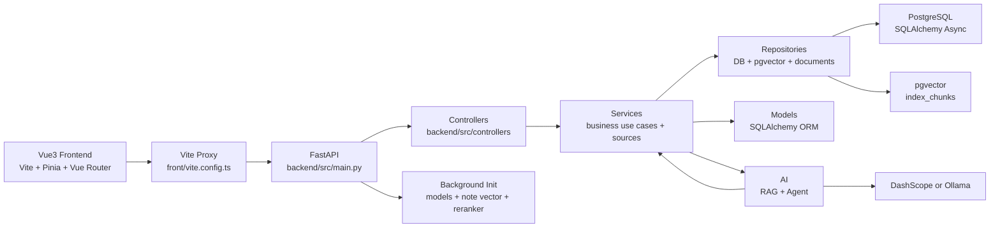

# RAGNotebook 改进版开发者指南

本文面向接手“RAGNotebook 改进版 / 云笺集”的开发者，说明当前代码结构、启动生命周期、核心数据流和扩展方式。文档以当前仓库实现为准：后端入口位于 `backend/src/main.py`，业务代码直接位于 `backend/src` 的扁平 MVC 分层目录，前端位于 `front/src`。

## 1. 架构总览



核心分层：

| 层级 | 目录 | 职责 |
| --- | --- | --- |
| 前端页面 | `front/src/views` | 页面状态、交互、SSE 消费和可视化渲染 |
| 前端 API | `front/src/features/*/api.ts`、`front/src/api` | feature API 为主，旧 `front/src/api` 保留 re-export 和共享 client |
| 控制器层 | `backend/src/controllers` | 参数声明、鉴权、限流、响应封装、流式响应 |
| 服务层 | `backend/src/services` | 笔记、知识库、模板、回顾、测评、导图、用户、来源注册和业务用例 |
| 仓储层 | `backend/src/repositories` | pgvector 统一索引、运行态存储、文档解析和用户数据访问 |
| 模型层 | `backend/src/models` | SQLAlchemy ORM |
| View/DTO | `backend/src/schemas` | Pydantic 请求、响应和引用模型 |
| AI 编排 | `backend/src/ai` | RAG、Agent、重排序、检索器和文档处理 |
| 数据库启动 | `backend/src/db` | engine/session、自动迁移和测试用户初始化 |
| 公共能力 | `backend/src/core`、`backend/src/utils` | 日志、异常、限流、配置、模型工厂、文件解析 |

## 2. 目录职责

### 根目录

| 路径 | 说明 |
| --- | --- |
| `start.py` | 本地开发一键启动脚本，负责 `config/.env`、依赖检查、数据库服务、后端和前端进程 |
| `docker-compose.yml` | 本地 PostgreSQL + pgvector 服务 |
| `config/.env.example` | 一键启动主配置模板 |
| `README.md` | 面向使用者的说明 |
| `docs/` | 面向开发和维护的文档 |
| `images/` | README 截图 |

### 后端

| 路径 | 说明 |
| --- | --- |
| `backend/src/main.py` | FastAPI app、路由注册、中间件、静态媒体、启动和关闭事件 |
| `backend/src/controllers/` | FastAPI 控制器，按业务暴露路由 |
| `backend/src/services/` | 应用服务、知识库服务、笔记索引和来源注册 |
| `backend/src/repositories/` | 数据访问和基础设施适配：运行态存储、pgvector、文档解析、用户仓储 |
| `backend/src/schemas/` | Pydantic 请求/响应模型，按业务拆分 |
| `backend/src/models/` | SQLAlchemy ORM |
| `backend/src/ai/` | RAG、Agent、重排序、检索器和文档处理 |
| `backend/src/db/` | 数据库 URL 解析、engine/session 和自动迁移 |
| `backend/src/config/` | `vector_store.yaml`、Agent、prompt 和 Uvicorn 配置 |
| `backend/src/prompt/` | 自动标签、写作、问答、测评、总结等提示词 |
| `backend/alembic/` | 数据库迁移脚本 |
| `backend/openapi.json` | 当前 API 静态快照 |

### 前端

| 路径 | 说明 |
| --- | --- |
| `front/src/main.ts` | Vue app 入口 |
| `front/src/App.vue` | 顶层 RouterView |
| `front/src/components/AppShell.vue` | 登录后的主布局、导航和退出登录 |
| `front/src/components/RichEditor.vue` | Tiptap 编辑器 |
| `front/src/views/` | 页面组件 |
| `front/src/features/knowledge/api.ts` | 知识库 document_id API |
| `front/src/features/notes/api.ts` | 笔记 API |
| `front/src/features/sources/` | 来源类型导出 |
| `front/src/api/endpoints.ts` | 后端路径集中定义 |
| `front/src/api/client.ts` | Axios 实例、JWT 注入、401 处理 |
| `front/src/router/index.ts` | 路由表和登录态守卫 |
| `front/src/stores/` | Pinia store |
| `front/src/types/api.ts` | 前端业务类型 |

## 3. 启动生命周期

### `start.py`

`python start.py` 的流程：

1. 读取参数：`--install`、`--backend-only`、`--frontend-only`、`--skip-db` 等。
2. 确保 `config/.env` 存在，优先从 `config/.env.example` 创建。
3. 如 `ALIYUN_ACCESS_KEY_SECRET` 指向 `apikey.txt` 且文件不存在，创建 `config/apikey.txt` 模板文件。
4. 读取 `config/.env`，解析文件型密钥，并注入 `RAGNOTEBOOK_ENV_INJECTED=1`。
5. 设置 `PYTHONPATH=backend/src`。
6. 可选安装依赖：后端优先 `uv sync`，前端运行 `npm install`。
7. 检查后端依赖、`python-magic` 原生库和前端 `node_modules`。
8. 通过 Docker Compose 启动 PostgreSQL，并等待端口可用。
9. 启动 `uvicorn main:app --reload`；数据库检查和空库 Alembic 初始化由 FastAPI startup 执行。
10. 等后端后台初始化完成后启动 `npm run dev`。

### FastAPI

`backend/src/main.py` 启动事件：

1. `init_db()`：根据 `PG_AUTO_INIT` 初始化空数据库；已有 Alembic 版本表时执行 `upgrade head` 应用新增迁移，本地兜底可用 `DB_AUTO_CREATE_TABLES`。
2. `seed_test_user()`：确保默认测试用户存在。
3. `init_database_session_manager()`：启用 PostgreSQL 会话管理器。
4. `cleanup_expired_runtime_state()`：清理缓存、限流计数和 Token 黑名单。
5. `init_manager.start()`：后台初始化模型、笔记向量服务和重排序模型。

关闭事件会释放 SQLAlchemy async engine，避免连接池跨事件循环残留。

## 4. 路由和接口分组

| 前缀 | 文件 | 职责 |
| --- | --- | --- |
| `/health` | `health.py` | 存活和就绪检查 |
| `/user` | `user.py` | 登录、注册、刷新 Token、登出、资料更新、密码重置 |
| `/file` | `user.py` | 用户头像等文件上传 |
| `/chat` | `chat.py` | Agent SSE、RAG 查询、会话列表、会话详情、重排序 |
| `/knowledge` | `api/knowledge.py` | 文档资源上传、SSE 进度、列表、详情、切片、图片和 deprecated 兼容入口 |
| `/note` | `note_router.py` | 笔记 CRUD、搜索、批量操作、补全、写作辅助、关联推荐 |
| `/note-template` | `note_template_router.py` | 笔记模板 |
| `/review` | `review_router.py` | 每日回顾、标记完成、生成问题 |
| `/quick-test` | `quick_test_router.py` | 快速测试创建、答题、查询、结束 |
| `/mindmaps` | `mindmap_router.py` | 思维导图生成、查询、更新、导出 |

路由约定：

- 受保护接口通过 `get_current_user_id` 解析 JWT。
- 高成本接口接入 `rate_limit(...)`，是否启用由 `RATE_LIMIT_ENABLED` 控制。
- 普通响应使用 `success_response(...)`，流式响应使用 `StreamingResponse`。
- 路由层只做输入输出和依赖声明，复杂流程放到 service、RAG 或 Agent。

## 5. 数据模型和存储边界

### 关系表

| 表 | 主要用途 |
| --- | --- |
| `user_service` | 用户账号、资料、密码哈希、状态 |
| `notes` | 笔记正文、标签、分类、置顶 |
| `knowledge_documents` | 知识库文档事实表，保存 document_id、文件名、MD5、大小、MIME、状态和切片数量 |
| `note_templates` | 用户模板和默认模板 |
| `review_records` | 回顾次数、间隔、下次回顾时间 |
| `chat_sessions` | 对话会话元数据 |
| `chat_messages` | 对话消息 |
| `study_test_sessions` | 快速测试会话 |
| `study_test_turns` | 快速测试每轮问答和反馈 |
| `mind_maps` | 思维导图图结构、引用、版本 |
| `app_cache` | 短期运行态缓存 |
| `token_blacklist` | 登出和撤销后的 Token 黑名单 |
| `rate_limit_counters` | 固定窗口限流计数 |

### 向量表

`index_chunks` 是统一 pgvector 索引表，通过 `source_type` 和 `source_id` 关联笔记或知识库文档：

| source_type | source_id | 内容 | 关键 metadata |
| --- | --- | --- |
| `knowledge` | `knowledge_documents.id` | 知识库文档切片 | `document_id`、`original_filename`、`md5` |
| `note` | `notes.id` | 笔记全文索引 | `note_id`、`title`、`doc_type=note` |

`vector_chunks` 和 `knowledge_md5_records` 是历史兼容结构，新增业务不再依赖它们。PDF 多模态解析得到的图片位于 `backend/data/extracted_images/{user_id}/{md5}/`，头像等媒体位于 `backend/data/media/`。

数据访问原则：

- 所有用户数据查询必须带 `user_id`。
- 向量检索和删除必须带 metadata 过滤。
- 表结构变更通过 Alembic 表达，不依赖运行时隐式补表。
- `EMBEDDING_DIM` 必须与嵌入模型输出维度一致。

## 6. 核心链路

### 笔记创建

1. 前端调用 `/note/create`。
2. `NoteService` 写入 `notes`。
3. `NoteIndexService` 异步写入 `index_chunks(source_type=note, source_id=note_id)`。
4. 如缺少标签或分类，后台调用 LLM 自动补齐。
5. 创建初始回顾记录。

### 知识库上传

1. 前端调用 `/knowledge/documents`。
2. 后端校验扩展名、大小和 MIME。
3. 写入或更新 `knowledge_documents`，生成稳定 `document_id`。
4. 解析文件并切片。
5. 写入 `index_chunks(source_type=knowledge, source_id=document_id)`。
6. 更新文档状态和 `chunk_count`，SSE 返回处理进度。

支持的知识库文件类型由 `backend/src/config/vector_store.yaml` 控制：`txt`、`pdf`、`md`、`pptx`、`docx`。

### RAG 问答

1. `/chat/agent/query/stream` 创建 Agent 执行。
2. Agent 工具调用 RAG 服务。
3. RAG 服务生成 HyDE 查询文本。
4. 通过 `SourceRegistry` 检索知识库和笔记来源，并按 `user_id` 隔离。
5. 重排序后总结片段。
6. 通过 SSE 返回思考过程和回答。

### 快速测试

1. 前端选择来源、题数、难度和关注点。
2. `SourceRegistry` 收集笔记、知识库或混合片段。
3. LLM 生成首题并写入 `study_test_sessions`、`study_test_turns`。
4. 用户答题后生成反馈、分数和下一题。
5. 结束时生成总结、薄弱点和推荐引用。

### 思维导图

1. 前端选择来源并提交 `/mindmaps/generate`。
2. 后端收集来源片段。
3. LLM 生成 nodes/edges JSON。
4. 图结构保存到 `mind_maps.graph`。
5. 前端用 Vue Flow 渲染，可更新节点边并导出 JSON/Mermaid。

## 7. 配置和模型

配置来源：

| 配置 | 来源 |
| --- | --- |
| 服务端口、数据库、CORS、JWT、限流 | `config/.env` |
| 前端代理目标 | `VITE_BACKEND_TARGET` |
| 阿里云真实 key | `config/apikey.txt` |
| 向量库和切片 | `backend/src/config/vector_store.yaml` |
| Prompt 映射 | `backend/src/config/prompt.yaml` |
| Agent 配置 | `backend/src/config/agent.yaml` |

模型工厂位于 `backend/src/utils/factory.py`：

- `ChatModelFactory`：根据 `LLM_TYPE=ALIYUN|OLLAMA` 创建聊天模型。
- `EmbedModelFactory`：根据 `EMBED_MODEL_TYPE=ALIYUN|OLLAMA` 创建嵌入模型。
- `VisionModelFactory`：根据 `VISION_MODEL_TYPE=ALIYUN|OLLAMA` 创建视觉模型。

## 8. 前端实现约定

- 新接口先登记到 `front/src/api/endpoints.ts`，再在具体 API 文件封装。
- 需要鉴权的请求走 `client.ts`，流式接口可用 `fetch` 手动带 `Authorization`。
- 页面路由在 `front/src/router/index.ts` 注册，登录后页面挂在 `AppShell` children 下。
- 共享状态放 Pinia store，页面局部状态保留在组件内。
- 页面样式优先复用 `front/src/index.css` 中的变量和现有 Tailwind 风格。

## 9. 扩展指南

### 新增后端接口

1. 在 `backend/src/schemas/` 增加请求和响应模型。
2. 如需持久化，在 `backend/src/models/` 增加 ORM。
3. 新增 Alembic revision。
4. 在 `backend/src/services/` 或 `backend/src/repositories/` 实现业务逻辑和数据访问，保留 `user_id` 边界。
5. 在 `backend/src/controllers/` 增加新路由，接入鉴权和限流。
6. 在 `backend/src/main.py` 注册 router。
7. 同步前端 endpoints、API 封装和类型。

### 新增文档类型

1. 更新 `vector_store.yaml` 的 `allow_knowledge_file_types`。
2. 在 `services/knowledge_service.py` 中补充扩展名和 MIME 校验。
3. 在 `utils/file_handler.py` 实现 loader。
4. 在 `repositories/document_parser.py` 或底层 loader 中接入同步和异步分支。
5. 如涉及图片，补充图片存储和访问校验。

### 新增 Agent 工具

1. 在 `ai/agent/agent_tools.py` 定义工具。
2. 访问用户数据时从上下文获取当前用户。
3. 数据库访问使用 async session，并捕获异常。
4. 在默认工具集合中注册。
5. 更新主提示词，让模型知道何时调用。

## 10. 测试和验收

后端：

```powershell
cd backend
$env:PYTHONPATH = "src"
.venv\Scripts\python.exe -m pytest
.venv\Scripts\python.exe -m ruff check .
```

本地演示测试数据：

```powershell
backend\.venv\Scripts\python.exe scripts\seed_demo_data.py --dry-run
backend\.venv\Scripts\python.exe scripts\seed_demo_data.py
```

演示账号为 `demo_user / demo1234`。默认 seed 为幂等追加，只更新固定 demo 用户、固定 demo ID 和 fixture 文件名对应的数据；如需重建演示数据，可加 `--reset-demo`。当本地嵌入模型或 API Key 暂不可用时，可先用 `--skip-knowledge` 只写入关系型演示数据并跳过向量同步。

运行完整 seed 前需确认数据库迁移已完成、pgvector 扩展可用，并且 `EMBED_MODEL_TYPE`、`EMBEDDING_DIM` 与实际嵌入模型输出一致。

前端：

```bash
cd front
npm run build
npm run lint
```

OpenAPI 快照：

```powershell
cd backend
$env:PYTHONPATH = "src"
.venv\Scripts\python.exe -c "from main import app; print(len(app.openapi().get('paths', {})))"
```

手工验收：

1. `python start.py` 能启动数据库、后端和前端。
2. 登录后能创建笔记、搜索笔记、上传知识库文件。
3. AI 问答能返回 SSE 流式结果。
4. 快速测试能创建、答题、结束。
5. 思维导图能生成、编辑、导出。
6. 登出后受保护页面跳转登录页。

## 11. 维护约定

- 文档跟随代码更新，尤其是路由、表结构、配置项和核心数据流。
- 关系表变更必须新增 Alembic 迁移。
- 向量数据 metadata 必须保留可追踪字段。
- Prompt 放在 `backend/src/prompt/`，避免长提示词硬编码。
- 运行时数据、真实 `config/.env`、密钥、模型文件和数据库卷不提交。
