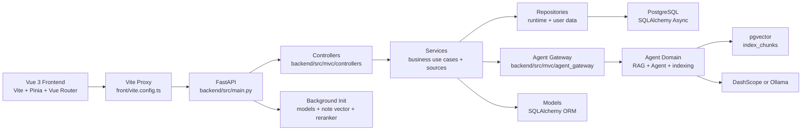

# RAGNotebook 改进版开发者指南

本文面向接手“RAGNotebook 改进版 / 云笺集”的开发者，说明当前代码结构、启动生命周期、核心数据流和扩展方式。文档以当前仓库实现为准：后端入口位于 `backend/src/main.py`，业务代码按 `mvc` 与 `agent` 两个主域组织，前端位于 `front/src`。

## 1. 架构总览



核心分层：

| 层级 | 目录 | 职责 |
| --- | --- | --- |
| 前端页面 | `front/src/views` | 页面状态、交互、SSE 消费和可视化渲染 |
| 前端 API | `front/src/features/*/api.ts`、`front/src/api` | feature API 为主，旧 `front/src/api` 保留 re-export 和共享 client |
| 控制器层 | `backend/src/mvc/controllers` | 参数声明、鉴权、限流、响应封装、流式响应 |
| 服务层 | `backend/src/mvc/services` | 笔记、知识库、模板、测评、导图、用户、来源注册和业务用例 |
| 仓储层 | `backend/src/mvc/repositories` | 运行态存储和用户数据访问 |
| 模型层 | `backend/src/mvc/models` | SQLAlchemy ORM |
| View/DTO | `backend/src/mvc/schemas` | Pydantic 请求、响应和引用模型 |
| Agent Gateway | `backend/src/mvc/agent_gateway` | MVC 调用 Agent 能力的唯一入口 |
| Agent 域 | `backend/src/agent` | RAG、Agent、重排序、检索器、Prompt、模型和索引 |
| 数据库启动 | `backend/src/db` | engine/session、新库/空库建表和测试用户初始化 |
| 公共能力 | `backend/src/core`、`backend/src/utils` | 日志、异常、限流、配置、文件解析和路径工具 |

## 2. 目录职责

### 根目录

| 路径 | 说明 |
| --- | --- |
| `start.py` | 本地开发一键启动脚本，负责 `config/.env`、依赖检查、数据库服务、后端和前端进程 |
| `docker-compose.yml` | 本地 PostgreSQL + pgvector 服务 |
| `config/.env.example` | 一键启动主配置模板 |
| `backend/.env.example` | 后端单独启动配置模板 |
| `front/.env.example` | 前端单独启动配置模板 |
| `README.md` | 面向使用者的说明 |
| `docs/` | 面向开发和维护的文档 |
| `scripts/` | 模型下载、PostgreSQL 和本地用户辅助脚本 |
| `test_data/` | 手工上传和解析验证用的本地测试数据集 |

### 后端

| 路径 | 说明 |
| --- | --- |
| `backend/src/main.py` | FastAPI app、路由注册、中间件、启动和关闭事件；也作为后端单独启动入口读取 `backend/.env` |
| `backend/src/mvc/controllers/` | FastAPI 控制器，按业务暴露路由 |
| `backend/src/mvc/services/` | 应用服务、知识库服务、笔记索引和来源注册 |
| `backend/src/mvc/repositories/` | 数据访问和 MVC 基础设施适配：运行态存储、用户仓储 |
| `backend/src/mvc/schemas/` | Pydantic 请求/响应模型，按业务拆分 |
| `backend/src/mvc/models/` | SQLAlchemy ORM |
| `backend/src/mvc/agent_gateway/` | MVC 到 Agent 的调用门面 |
| `backend/src/agent/` | RAG、Agent、重排序、检索器、模型工厂、Prompt 和索引 |
| `backend/src/db/` | 数据库 URL 解析、engine/session 和新库/空库建表 |
| `backend/config/` | Agent 和 Uvicorn 配置 |
| `backend/.env` | 后端单独启动时读取的本地配置，不提交 |
| `backend/src/agent/prompts/` | 自动标签、写作、问答、测评、总结等提示词 |
| `backend/openapi.json` | 当前 API 静态快照 |

### 前端

| 路径 | 说明 |
| --- | --- |
| `front/src/main.ts` | Vue app 入口 |
| `front/src/App.vue` | 顶层 RouterView |
| `front/src/components/AppShell.vue` | 登录后的主布局、导航和退出登录 |
| `front/src/components/RichEditor.vue` | Tiptap 编辑器 |
| `front/src/views/` | 页面组件 |
| `front/src/features/knowledge/api.ts` | 知识库 document_id API |
| `front/src/features/notes/api.ts` | 笔记 API |
| `front/src/features/sources/` | 来源类型导出 |
| `front/src/api/endpoints.ts` | 后端路径集中定义 |
| `front/src/api/client.ts` | Axios 实例、JWT 注入、401 处理 |
| `front/src/router/index.ts` | 路由表和登录态守卫 |
| `front/src/stores/` | Pinia store |
| `front/src/types/api.ts` | 前端业务类型 |

## 3. 启动生命周期

### `start.py`

`python start.py` 的流程：

1. 读取参数：`--install`、`--backend-only`、`--frontend-only`、`--skip-db` 等。
2. 确保 `config/.env` 存在，优先从 `config/.env.example` 创建。
3. 如 `ALIYUN_ACCESS_KEY_SECRET` 指向 `apikey.txt` 且文件不存在，创建 `config/apikey.txt` 模板文件。
4. 读取 `config/.env`，解析文件型密钥，并注入 `RAGNOTEBOOK_ENV_INJECTED=1`。
5. 设置 `PYTHONPATH=backend/src`。
6. 可选安装依赖：后端优先 `uv sync`，前端运行 `npm install`。
7. 检查后端依赖、`python-magic` 原生库和前端 `node_modules`。
8. 通过 Docker Compose 启动 PostgreSQL，并等待端口可用。
9. 启动 `uvicorn main:app --reload`；数据库检查和新库/空库建表由 FastAPI startup 执行。
10. 等后端后台初始化完成后启动前端开发服务。

### 后端单独启动

```powershell
cd backend
.venv\Scripts\python.exe src\main.py
```

该入口只读取 `backend/.env`。统一启动时不要调用它，继续使用根目录 `python start.py`。

### FastAPI

`backend/src/main.py` 启动事件：

1. `init_db()`：只支持新库/空库或已由当前版本创建的库；启动时创建 ORM 表、pgvector 扩展和 `index_chunks`，遇到旧库/不匹配 schema 会要求重建数据库。
2. 当 `SEED_TEST_USER=true` 时执行 `seed_test_user()`：确保本地默认测试用户 `admin/admin1234` 存在；非本地环境建议关闭。
3. `init_database_session_manager()`：启用 PostgreSQL 会话管理器。
4. `cleanup_expired_runtime_state()`：清理缓存、限流计数和 Token 黑名单。
5. `init_manager.start()`：后台初始化模型、笔记向量服务和重排序模型。

关闭事件会释放 SQLAlchemy async engine，避免连接池跨事件循环残留。

## 4. 路由和接口分组

| 前缀 | 文件 | 职责 |
| --- | --- | --- |
| `/health` | `health_controller.py` | 存活和就绪检查 |
| `/user` | `user_controller.py` | 登录、注册、刷新 Token、登出、资料更新、密码重置 |
| `/file` | `user_controller.py` | 用户头像等文件上传 |
| `/chat` | `chat_controller.py` | Agent SSE、RAG 查询、会话列表、会话详情、项目文件和重排序 |
| `/knowledge` | `knowledge_controller.py` | 文档资源上传、SSE 进度、列表、详情、切片、预览和去重记录 |
| `/documents` | `document_controller.py` | 统一文档下载 |
| `/projects` | `project_controller.py` | 聊天项目、项目文件和项目会话 |
| `/note` | `note_controller.py` | 笔记 CRUD、搜索、批量操作、补全、写作辅助、关联推荐 |
| `/note-template` | `note_template_controller.py` | 笔记模板 |
| `/quick-test` | `quick_test_controller.py` | 快速测试创建、答题、查询、结束 |
| `/mindmaps` | `mindmap_controller.py` | 思维导图生成、查询、更新、导出 |

路由约定：

- 受保护接口通过 `get_current_user_id` 解析 JWT。
- 高成本接口接入 `rate_limit(...)`，是否启用由 `RATE_LIMIT_ENABLED` 控制。
- 普通响应使用 `success_response(...)`，流式响应使用 `StreamingResponse`。
- 路由层只做输入输出和依赖声明，复杂流程放到 service、RAG 或 Agent。

## 5. 数据模型和存储边界

### 关系表

| 表 | 主要用途 |
| --- | --- |
| `app_users` | 用户账号、资料、密码哈希、状态 |
| `storage_objects` | 文件存储后端、URI、绝对路径、原始文件名、MIME、扩展名、SHA-256、大小和状态 |
| `documents` | 笔记和知识库的统一文档元数据，保存 `source_type`、标题、存储对象、内容 hash、状态和切片数量 |
| `notes` | 笔记业务元数据，正文通过 `document_id` 指向 Markdown 文件 |
| `note_templates` | 用户模板和默认模板 |
| `chat_sessions` | 对话会话元数据 |
| `chat_messages` | 对话消息 |
| `quiz_sessions` | 快速测试会话 |
| `quiz_turns` | 快速测试每轮问答和反馈 |
| `mind_maps` | 思维导图图结构、引用、版本 |
| `app_cache_entries` | 短期运行态缓存 |
| `auth_revoked_tokens` | 登出和撤销后的 Token |
| `rate_limit_buckets` | 固定窗口限流桶 |

### 向量表

`index_chunks` 是统一 pgvector 索引表，通过 `document_id` 关联 `documents`：

| source_type | document_id | 内容 | 关键 metadata |
| --- | --- | --- | --- |
| `knowledge` | `documents.id` | 知识库文档切片 | `document_id`、`original_filename`、`content_hash` |
| `note` | `documents.id` | 笔记 Markdown 全文索引 | `note_id`、`title`、`doc_type=note` |

持久文件只允许通过 `StorageService` 写入。`FILE_STORAGE_HOST=localhost` 或 `127.0.0.1` 时使用本机目录，`FILE_STORAGE_BASE_DIR` 为空则默认 `backend/data`；远程模式首期使用 SFTP，并要求配置远程 `FILE_STORAGE_BASE_DIR`。数据库只保存 `storage_uri`、`storage_path`、hash、大小、状态和业务元数据。

数据访问原则：

- 所有用户数据查询必须带 `user_id`。
- 索引检索和删除必须带 `user_id` 与 `document_id`/`source_type` 边界。
- 表结构变更当前按新库基线处理；本地旧库不做兼容迁移，需重建数据库或清空 `public` schema。
- `EMBEDDING_DIM` 必须与嵌入模型输出维度一致。

## 6. 核心链路

### 笔记创建

1. 前端调用 `/note/create`。
2. `NoteService` 将正文保存为 Markdown 文件，并写入 `storage_objects`、`documents(source_type=note)` 和 `notes`。
3. `NoteIndexService` 异步写入 `index_chunks(source_type=note, document_id=document_id)`。
4. 如缺少标签或分类，后台调用 LLM 自动补齐。

### 知识库上传

1. 前端调用 `/knowledge/documents`。
2. 后端校验扩展名、大小和 MIME。
3. 通过 `StorageService` 保存原始上传文件。
4. 写入 `storage_objects` 和 `documents(source_type=knowledge)`。
5. 从存储层读取原文件，解析文件并切片。
6. 写入 `index_chunks(source_type=knowledge, document_id=document_id)`。
7. 更新文档状态和 `chunk_count`，SSE 返回处理进度。

知识库文件保持用户上传的原始格式；只有笔记导入会转为 Markdown 后保存。

### RAG 问答

1. `/chat/agent/query/stream` 创建 Agent 执行。
2. Agent 工具调用 RAG 服务。
3. RAG 服务生成 HyDE 查询文本。
4. 通过 `SourceRegistry` 检索知识库和笔记来源，并按 `user_id` 隔离。
5. 重排序后总结片段。
6. 通过 SSE 返回思考过程和回答。

### 快速测试

1. 前端选择来源、题数、难度和关注点。
2. `SourceRegistry` 收集笔记、知识库或混合片段。
3. LLM 生成首题并写入 `quiz_sessions`、`quiz_turns`。
4. 用户答题后生成反馈、分数和下一题。
5. 结束时生成总结、薄弱点和推荐引用。

### 思维导图

1. 前端选择来源并提交 `/mindmaps/generate`。
2. 后端收集来源片段。
3. LLM 生成 nodes/edges JSON。
4. 图结构保存到 `mind_maps.graph`。
5. 前端用树状画布渲染，支持拖拽缩放、复制大纲并导出 JSON/Mermaid。

## 7. 配置和模型

配置来源：

| 配置 | 来源 |
| --- | --- |
| 统一启动配置 | `config/.env`，仅由 `start.py` 读取并注入 |
| 后端单独启动配置 | `backend/.env` |
| 前端单独启动配置 | `front/.env` |
| 前端代理目标 | `VITE_BACKEND_TARGET` |
| 阿里云真实 key | `config/apikey.txt` |
| 文件存储 | `FILE_STORAGE_*` 环境变量 |
| 切片默认值 | `backend/src/agent/rag/text_spliter.py` |
| Prompt 模板 | `backend/src/agent/prompts/` |
| Agent 配置 | `backend/config/agent.yaml` |

模型工厂位于 `backend/src/agent/models/factory.py`：

- `ChatModelFactory`：根据 `LLM_TYPE=ALIYUN|OLLAMA` 创建聊天模型。
- `EmbedModelFactory`：根据 `EMBED_MODEL_TYPE=ALIYUN|OLLAMA` 创建嵌入模型。
- `VisionModelFactory`：根据 `VISION_MODEL_TYPE=ALIYUN|OLLAMA` 创建视觉模型。

## 8. 前端实现约定

- 新接口先登记到 `front/src/api/endpoints.ts`，再在具体 API 文件封装。
- 需要鉴权的请求走 `client.ts`，流式接口可用 `fetch` 手动带 `Authorization`。
- 页面路由在 `front/src/router/index.ts` 注册，登录后页面挂在 `AppShell` children 下。
- 共享状态放 Pinia store，页面局部状态保留在组件内。
- 页面样式优先复用 `front/src/index.css` 中的变量和现有 Tailwind 风格。

## 9. 扩展指南

### 新增后端接口

1. 在 `backend/src/mvc/schemas/` 增加请求和响应模型。
2. 如需持久化，在 `backend/src/mvc/models/` 增加 ORM。
3. 更新 SQLAlchemy ORM 和 `backend/src/db/db_config.py` 中的非 ORM 表初始化逻辑。
4. 在 `backend/src/mvc/services/` 或 `backend/src/mvc/repositories/` 实现业务逻辑和数据访问，保留 `user_id` 边界。
5. 如需调用 LLM/RAG/索引能力，通过 `backend/src/mvc/agent_gateway/` 封装。
6. 在 `backend/src/mvc/controllers/` 增加新路由，接入鉴权和限流。
7. 在 `backend/src/main.py` 注册 router。
8. 同步前端 endpoints、API 封装和类型。

### 新增文档类型

1. 在 `services/knowledge_service.py` 中补充扩展名和 MIME 校验。
2. 在 `utils/file_handler.py` 实现 loader。
3. 在 `agent/indexing/document_parser.py` 或底层 loader 中接入同步和异步分支。
4. 如涉及图片或附件，统一通过 `StorageService` 保存和访问。

### 新增 Agent 工具

1. 在 `backend/src/agent/runtime/agent_tools.py` 定义工具。
2. 访问用户数据时从上下文获取当前用户。
3. 数据库访问使用 async session，并捕获异常。
4. 在默认工具集合中注册。
5. 更新主提示词，让模型知道何时调用。

## 10. 测试和验收

后端：

```powershell
cd backend
$env:PYTHONPATH = "src"
.venv\Scripts\python.exe -m pytest
.venv\Scripts\python.exe -m ruff check .
```

本地测试数据：

- `test_data/upload_test_dataset/`：少量 TXT / PDF / MD / DOCX / PPTX 文件，适合快速验证上传、解析、切片和预览链路。
- `test_data/realistic_user_dataset/`：围绕同一研究主题组织的多格式资料，适合验证跨来源检索、来源核对和 RAG 复用。

上传测试数据前需确认后端已在新库/空库完成 schema 初始化、pgvector 扩展可用，并且 `EMBED_MODEL_TYPE`、`EMBEDDING_DIM` 与实际嵌入模型输出一致。

前端：

```bash
cd front
npm.cmd run build
npm.cmd run lint
```

OpenAPI 快照：

```powershell
cd backend
$env:PYTHONPATH = "src"
.venv\Scripts\python.exe -c "from main import app; print(len(app.openapi().get('paths', {})))"
```

手工验收：

1. `python start.py` 能启动数据库、后端和前端。
2. 登录后能创建笔记、搜索笔记、上传知识库文件。
3. AI 问答能返回 SSE 流式结果。
4. 快速测试能创建、答题、结束。
5. 思维导图能生成、查看、交互浏览和导出。
6. 登出后受保护页面跳转登录页。

## 11. 维护约定

- 文档跟随代码更新，尤其是路由、表结构、配置项和核心数据流。
- 关系表变更必须同步 ORM、数据库初始化逻辑、契约测试和文档；本地旧库不做兼容迁移。
- 向量数据 metadata 必须保留可追踪字段。
- Prompt 放在 `backend/src/agent/prompts/`，避免长提示词硬编码。
- 运行时数据、真实 `config/.env`、密钥、模型文件和数据库卷不提交。
