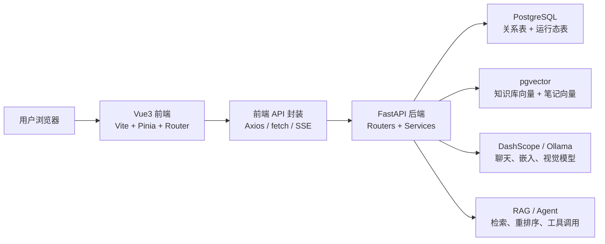

# 云笺集企业级开发文档

版本：v1.0  
日期：2026-06-22  
适用项目：RAGNotebook 改进版 / 云笺集  
文档定位：面向项目答辩、课程交付和团队协作的企业级开发总览文档

## 1. 项目概述

云笺集是基于 RAGNotebook 二次开发的智能笔记与知识库系统。项目围绕“资料沉淀、智能检索、测评反馈、结构化输出”构建学习闭环，将原有 RAG Notebook 思路升级为一套可本地部署、可持续维护、具备用户隔离和新库初始化能力的工程化应用。

当前项目采用前后端分离架构：

| 层级 | 当前实现 |
| --- | --- |
| 前端 | Vue3、TypeScript、Vite、Pinia、Vue Router、Tailwind CSS、Tiptap、自定义树状画布 |
| 后端 | FastAPI、SQLAlchemy Async、LangChain、DashScope / Ollama |
| 数据库 | PostgreSQL、pgvector |
| 运行态治理 | PostgreSQL 缓存、Token 黑名单、限流计数、后台初始化状态 |
| 本地启动 | 根目录 `start.py` 统一读取 `config/.env` 并启动数据库、后端、前端 |

本项目不是单一问答 Demo，而是面向个人学习、资料管理和知识复用的智能工作台，主要能力包括笔记管理、知识库上传、RAG 问答、AI 写作辅助、快速测试和思维导图生成。

## 2. 需求分析

### 2.1 建设背景

在学习、科研和企业知识沉淀场景中，用户经常面临以下问题：

| 问题 | 表现 |
| --- | --- |
| 资料分散 | PDF、文档、笔记和问答记录分布在不同工具中，难以统一检索 |
| 笔记复用率低 | 记录完成后缺少测验、反馈和结构化整理机制 |
| 知识检索效率低 | 关键词搜索无法理解语义，跨文档查找成本高 |
| 学习效果难验证 | 学完资料后缺少自动出题、反馈和薄弱点总结 |
| 工程可维护性不足 | 缺少统一数据库、新库初始化、测试、启动脚本和接口约定 |

因此，本项目需要建设一套具备企业级工程基础的智能知识管理系统，使用户能够把资料、笔记、问答、测验和结构化整理统一纳入同一个应用闭环。

### 2.2 建设目标

项目建设目标分为业务目标和工程目标：

| 类型 | 目标 |
| --- | --- |
| 业务目标 | 支持用户管理笔记、上传资料、进行知识库问答、生成学习测验和思维导图 |
| 学习目标 | 通过快速测试、复盘和结构化导图提高知识复用率 |
| 数据目标 | 使用 PostgreSQL 统一承载关系数据、向量数据和运行态数据 |
| 工程目标 | 建立可维护的前后端分离架构、新库初始化、统一配置和测试体系 |
| 交付目标 | 提供可运行、可演示、可扩展、可验收的项目版本 |

### 2.3 用户角色与使用场景

| 用户角色 | 使用场景 | 主要诉求 |
| --- | --- | --- |
| 普通学习用户 | 写笔记、上传资料、问答、测验、整理结构 | 降低资料整理成本，提高学习效率 |
| 知识管理用户 | 建立个人知识库，按主题查询和复用资料 | 统一管理、多源检索、持续积累 |
| 系统管理员 / 开发维护者 | 部署服务、维护数据库、排查模型和依赖问题 | 可配置、可诊断、可扩展 |
| 项目评审人员 | 查看功能完整性、工程规范和测试结果 | 能清晰验证需求、架构、质量和分工 |

### 2.4 功能性需求

| 编号 | 需求 | 优先级 | 当前实现边界 |
| --- | --- | --- | --- |
| FR-01 | 用户注册、登录、登出、资料维护和 Token 鉴权 | 高 | 后端 `/user`，前端登录态守卫 |
| FR-02 | 笔记创建、编辑、搜索、分类、标签、置顶和导出 | 高 | 后端 `/note`，前端笔记列表和编辑器 |
| FR-03 | 笔记自动标签、AI 补全、续写、扩写和摘要 | 高 | 后端模型工厂、Prompt、笔记服务 |
| FR-04 | 知识库文件上传、切片、向量化、去重和详情查看 | 高 | 支持 TXT、PDF、MD、PPTX、DOCX |
| FR-05 | 基于知识库和笔记的 RAG 问答 | 高 | 后端 `/chat`，支持 SSE 流式响应 |
| FR-06 | NotebookLM 风格快速测试 | 高 | 后端 `/quick-test`，支持创建、答题、结束和总结 |
| FR-07 | 思维导图生成、查询和导出 | 高 | 后端 `/mindmaps`，前端树状画布渲染 |
| FR-08 | 会话历史管理 | 中 | PostgreSQL 存储聊天会话和消息 |
| FR-09 | 系统健康检查和后台初始化状态 | 高 | 后端 `/health`，覆盖数据库和模型运行态 |

### 2.5 非功能性需求

| 类型 | 要求 | 设计措施 |
| --- | --- | --- |
| 可维护性 | 模块职责清晰，便于多人协作 | 前端 views/api/stores 分层，后端 router/service/model/rag 分层 |
| 可扩展性 | 后续可新增接口、文档类型和 Agent 工具 | 通过 schemas、services、routers 和配置文件扩展 |
| 数据一致性 | 表结构与当前代码基线一致 | 启动仅支持新库/空库，初始化 PostgreSQL 和 pgvector 结构 |
| 安全性 | 用户数据隔离，鉴权访问受控 | JWT 鉴权，关系查询和向量检索均带 `user_id` 边界 |
| 可观测性 | 启动和运行异常可定位 | 健康检查、后台初始化状态、统一日志和排错文档 |
| 易部署性 | 本地开发可一键启动 | `start.py`、`docker-compose.yml`、`config/.env.example` |
| 兼容性 | 支持云端和本地模型 | DashScope 与 Ollama 双模型来源 |

## 3. 系统总体架构

系统采用浏览器前端、FastAPI 后端、PostgreSQL 数据库和模型服务组成的分层架构。



### 3.1 前端架构

前端位于 `front/src`，以 Vue3 单页应用为主体：

| 目录 | 职责 |
| --- | --- |
| `views` | 登录、笔记、知识库、聊天、快速测试、思维导图等页面 |
| `api` | 统一封装后端接口、鉴权头和流式请求 |
| `stores` | Pinia 状态管理 |
| `router` | 路由表和登录态守卫 |
| `components` | 主布局和富文本编辑器等复用组件 |

前端通过 `VITE_BACKEND_TARGET` 对接后端服务，开发环境由 Vite 代理转发请求。

### 3.2 后端架构

后端位于 `backend/src`，入口为 `main.py`：

| 层级 | 职责 |
| --- | --- |
| Router | 接口路径、请求参数、鉴权依赖、响应封装 |
| Service | 业务流程编排、数据库读写、模型调用 |
| RAG / Agent | 文档切片、语义检索、重排序、工具调用、流式问答 |
| Model | SQLAlchemy ORM 数据模型 |
| DB | 数据库连接、会话管理、新库初始化、运行态存储 |
| Utils / Core | 配置、日志、异常、限流、文件解析、模型工厂 |

该分层能使 3 名开发主力分别负责后端业务、前端交互、AI 与数据链路，降低并行开发冲突。

## 4. 核心模块设计

### 4.1 用户与权限模块

用户模块负责注册、登录、Token 刷新、登出、资料更新和头像上传。受保护接口通过 JWT 解析当前用户，后端查询必须使用当前 `user_id` 作为数据边界。

关键设计：

| 能力 | 说明 |
| --- | --- |
| 登录态守卫 | 前端访问业务页面前检查本地 Token |
| Token 黑名单 | 登出或撤销后的 Token 写入 PostgreSQL 运行态表 |
| 用户隔离 | 笔记、知识库、会话、测评和导图均按用户隔离 |

### 4.2 笔记模块

笔记模块是系统基础能力，支持 Markdown / Tiptap 编辑、分类、标签、置顶、搜索、导出和 AI 写作辅助。

核心链路：

1. 用户在前端创建或编辑笔记。
2. 后端写入 `notes` 表。
3. 笔记内容通过 `NoteIndexService` 同步进入 `index_chunks(source_type=note)`。
4. 后台根据内容生成标签和分类。
5. 自动标签和索引完成后，笔记可进入检索、快速测试和导图整理链路。

### 4.3 知识库与 RAG 模块

知识库模块负责文件上传、解析、切片、向量化、去重、详情和图片访问。当前支持 TXT、PDF、MD、PPTX、DOCX。

RAG 问答流程：

1. 用户发起聊天问题。
2. 后端根据问题生成检索查询。
3. 从知识库向量和笔记向量中按 `user_id` 检索相关片段。
4. 使用重排序服务提升候选片段质量。
5. 结合上下文调用大模型生成回答。
6. 通过 SSE 将过程和结果流式返回前端。

### 4.4 快速测试模块

快速测试模块面向 NotebookLM 风格的学习检测：

| 步骤 | 说明 |
| --- | --- |
| 来源选择 | 用户可选择笔记、知识库或混合来源 |
| 题目生成 | 后端收集来源片段并调用模型生成题目 |
| 答题反馈 | 用户提交答案后得到评分、解析和下一题 |
| 结束总结 | 生成总体表现、薄弱点和推荐复习引用 |

### 4.5 思维导图模块

思维导图模块将笔记或知识库内容结构化为 nodes / edges 图数据，前端转为树状画布渲染。用户可查询导图，并导出 JSON 或 Mermaid。

设计重点：

| 能力 | 说明 |
| --- | --- |
| 来源引用 | 导图节点保留引用来源，便于回溯 |
| 可交互 | 前端支持树状浏览、拖拽缩放和大纲复制 |
| 可导出 | 支持 JSON 和 Mermaid，方便进入报告或展示材料 |

## 5. 数据库与数据安全设计

### 5.1 数据库设计原则

项目使用 PostgreSQL 作为统一数据底座，使用 pgvector 承载知识库和笔记向量；后端启动只支持新库/空库并创建当前表结构。

| 数据类型 | 存储方式 |
| --- | --- |
| 用户、笔记、模板、会话、测评、导图 | PostgreSQL 关系表 |
| 文件存储事实 | `storage_objects` |
| 笔记和知识库文档事实 | `documents` |
| 知识库切片向量 | `index_chunks(source_type=knowledge)` |
| 笔记全文向量 | `index_chunks(source_type=note)` |
| 缓存、限流、Token 撤销 | PostgreSQL 运行态表 |
| 上传文件和媒体 | `StorageService` 管理的本机目录或 SFTP 目录，数据库保存 URI、路径和元信息 |

### 5.2 安全设计

| 风险 | 控制措施 |
| --- | --- |
| 未授权访问 | 业务接口统一接入 JWT 鉴权 |
| 越权读取数据 | 关系查询、向量检索和文件访问都校验 `user_id` |
| Token 被复用 | 登出 Token 写入黑名单 |
| 文件上传风险 | 白名单限制文件类型，后端校验扩展名和 MIME |
| API Key 泄露 | 真实模型 Key 存放在 `config/apikey.txt`，不提交到仓库 |
| 数据库结构漂移 | 以当前代码 schema 为基线；旧库需重建，不做兼容迁移 |

## 6. 接口与前后端协作说明

### 6.1 主要接口分组

| 接口前缀 | 功能 |
| --- | --- |
| `/health` | 存活检查、就绪检查和后台初始化状态 |
| `/user` | 注册、登录、登出、刷新 Token、用户资料 |
| `/file` | 头像等用户文件上传 |
| `/note` | 笔记 CRUD、搜索、批量操作、写作辅助 |
| `/note-template` | 笔记模板 |
| `/knowledge` | 知识库上传、进度、列表、详情、切片和图片访问 |
| `/chat` | Agent 流式问答、会话历史、RAG 查询 |
| `/quick-test` | 快速测试创建、答题、查询、结束 |
| `/mindmaps` | 思维导图生成、查询、更新、导出 |

### 6.2 协作约定

| 场景 | 约定 |
| --- | --- |
| 新增接口 | 后端先定义 schema、service、router，再同步前端 endpoints 和 API 封装 |
| 受保护接口 | 后端使用鉴权依赖，前端通过统一 client 注入 Token |
| 流式接口 | 后端返回 `StreamingResponse`，前端使用 fetch 处理 SSE |
| 错误处理 | 后端返回统一失败响应，前端按 401、业务错误和网络错误分类处理 |
| 类型同步 | 前端在 `types/api.ts` 维护请求和响应类型 |
| 文档同步 | 接口稳定后更新 OpenAPI 快照和相关开发文档 |

## 7. 五人团队分工

本项目按 5 人团队组织，包含 1 名项目经理、3 名开发主力和 1 名测试工程师。

| 角色 | 人数 | 核心职责 | 主要交付物 |
| --- | --- | --- | --- |
| 项目经理 | 1 | 需求拆解、任务排期、进度跟踪、风险管理、评审组织、文档统筹 | 需求文档、排期计划、会议纪要、验收清单 |
| 后端开发主力 | 1 | FastAPI 接口、PostgreSQL、权限、会话、运行态治理、接口联调 | 后端接口、数据库初始化、OpenAPI、后端测试 |
| 前端开发主力 | 1 | Vue3 页面、TypeScript 类型、Pinia 状态、路由守卫、交互和样式 | 前端页面、接口封装、交互联调结果 |
| AI / 全栈开发主力 | 1 | 知识库解析、RAG 检索、向量化、快速测试、思维导图、Prompt 优化 | RAG 链路、AI 功能模块、模型配置说明 |
| 测试工程师 | 1 | 测试计划、用例设计、接口测试、功能测试、回归测试、缺陷跟踪、验收报告 | 测试用例、缺陷清单、测试报告、验收记录 |

### 7.1 RACI 职责矩阵

说明：R 表示负责执行，A 表示最终负责，C 表示参与协商，I 表示知会。

| 工作项 | 项目经理 | 后端开发 | 前端开发 | AI / 全栈开发 | 测试 |
| --- | --- | --- | --- | --- | --- |
| 需求分析 | A/R | C | C | C | C |
| 数据库设计 | I | A/R | I | C | C |
| 用户与权限 | I | A/R | R | I | C |
| 笔记与知识库 | C | R | R | A/R | C |
| RAG 问答 | I | R | C | A/R | C |
| 快速测试 | C | R | R | A/R | C |
| 思维导图 | C | R | R | A/R | C |
| 前端体验 | C | C | A/R | C | C |
| 测试验收 | C | C | C | C | A/R |
| 交付文档 | A/R | C | C | C | C |

## 8. 开发里程碑与迭代计划

### 8.1 阶段计划

| 阶段 | 目标 | 主要任务 | 验收输出 |
| --- | --- | --- | --- |
| 第 1 阶段：需求分析与原型确认 | 明确项目边界和核心流程 | 需求梳理、角色分析、页面流程、接口初稿、任务拆分 | 需求清单、页面原型、迭代计划 |
| 第 2 阶段：基础架构与数据库建设 | 建立可运行工程底座 | FastAPI、Vue3、PostgreSQL、pgvector、启动脚本、登录鉴权 | 可启动环境、数据库初始化、基础接口 |
| 第 3 阶段：核心业务模块开发 | 完成主要业务闭环 | 笔记、知识库、聊天问答、会话管理、前后端联调 | 核心功能可演示 |
| 第 4 阶段：AI 能力与学习闭环增强 | 提升智能化和学习效果 | AI 写作、语义检索、快速测试、思维导图、Prompt 优化 | AI 模块可用且有引用来源 |
| 第 5 阶段：测试、修复、部署和验收 | 达到交付质量 | 功能测试、接口测试、回归测试、文档完善、演示数据、部署验证 | 测试报告、交付文档、验收清单 |

### 8.2 迭代管理规则

| 规则 | 说明 |
| --- | --- |
| 任务拆分 | 每个任务明确负责人、输入、输出和验收标准 |
| 分支管理 | 开发任务独立分支，合并前完成自测和代码审查 |
| 接口优先 | 前后端联调前先确认请求字段、响应字段和错误码 |
| 文档同步 | 影响启动、配置、接口或数据库的变更必须同步文档 |
| 缺陷闭环 | 测试发现问题后记录复现步骤、影响范围、负责人和修复结果 |

## 9. 测试方案

### 9.1 测试目标

测试目标是确认系统满足需求分析中的功能性和非功能性要求，重点验证核心链路、用户隔离、新库初始化、AI 模块可用性和前后端联调稳定性。

### 9.2 测试类型

| 类型 | 测试内容 | 负责人 |
| --- | --- | --- |
| 单元测试 | schema、service 工具函数、配置解析、数据模型边界 | 开发主力 |
| 接口测试 | 登录、笔记、知识库、聊天、快速测试、思维导图 | 测试工程师 + 后端开发 |
| 前端功能测试 | 页面路由、表单、列表、编辑器、流式输出、导图交互 | 测试工程师 + 前端开发 |
| 数据库测试 | 新库初始化、pgvector 表、运行态表、用户数据隔离 | 后端开发 + 测试工程师 |
| AI 功能测试 | RAG 引用质量、题目生成、反馈总结、导图结构 | AI / 全栈开发 + 测试工程师 |
| 回归测试 | 修复缺陷后验证原功能不退化 | 测试工程师 |
| 验收测试 | 按交付清单跑通完整演示流程 | 项目经理 + 测试工程师 |

### 9.3 重点测试场景

| 场景 | 验证点 |
| --- | --- |
| 用户登录和鉴权 | 未登录不能访问业务页面，Token 失效后跳转登录 |
| 笔记创建和检索 | 新建笔记可保存、编辑、搜索，并进入向量检索 |
| 知识库上传 | 支持文件可上传，非法类型被拒绝，切片和去重状态正确 |
| RAG 问答 | 能基于知识库和笔记返回答案，流式响应不中断 |
| 快速测试 | 能创建题目、提交答案、获得反馈、结束并生成总结 |
| 思维导图 | 能生成节点和边，支持查询、交互浏览和导出 |
| 用户隔离 | A 用户不能访问 B 用户的笔记、文件、向量和导图 |
| 健康检查 | 数据库、运行态和模型初始化状态可被 `/health` 反映 |
| 启动脚本 | `python start.py` 能按配置启动数据库、后端和前端 |

### 9.4 当前测试基础

项目已有后端测试文件覆盖以下方向：

| 测试文件 | 覆盖方向 |
| --- | --- |
| `backend/test/test_health_readiness.py` | 健康检查和模型运行态就绪状态 |
| `backend/test/test_enterprise_contracts.py` | 快速测试、思维导图等企业版契约 |
| `backend/test/test_note_import.py` | 笔记导入相关能力 |
| `backend/test/test_demo_dataset.py` | 演示数据 manifest 和引用完整性 |
| `backend/test/test_background_init_status.py` | 后台初始化状态 |
| `backend/test/test_dashscope_embeddings.py` | DashScope 嵌入模型相关行为 |

建议验收前执行：

```powershell
cd backend
$env:PYTHONPATH = "src"
.venv\Scripts\python.exe -m pytest
```

前端建议执行：

```powershell
cd front
npm run build
```

## 10. 部署与运行维护

### 10.1 本地开发部署

推荐使用根目录一键启动脚本：

```powershell
python start.py --install
python start.py
```

默认服务地址：

| 服务 | 默认地址 |
| --- | --- |
| 前端 | `http://127.0.0.1:11111` |
| 后端 | `http://127.0.0.1:10001` |
| API 文档 | `http://127.0.0.1:10001/docs` |
| PostgreSQL | `localhost:5432` |

### 10.2 配置管理

| 配置项 | 位置 | 说明 |
| --- | --- | --- |
| 统一启动配置 | `config/.env` | 仅由 `start.py` 读取，并注入给数据库、后端和前端 |
| 后端单启配置 | `backend/.env` | 手动单独启动后端时读取 |
| 前端单启配置 | `front/.env` | 手动单独启动前端时读取 |
| 配置模板 | `config/.env.example`、`backend/.env.example`、`front/.env.example` | 新环境初始化参考 |
| 模型 Key | `config/apikey.txt` | 存放真实 API Key，不提交仓库 |
| 文件存储配置 | `FILE_STORAGE_*` | 本机目录或 SFTP 文件服务器 |
| 切片默认值 | `backend/src/agent/rag/text_spliter.py` | 默认切片大小、重叠和分隔符 |
| 前端代理 | `VITE_BACKEND_TARGET` | 指向后端服务地址 |

### 10.3 运维关注点

| 关注点 | 处理方式 |
| --- | --- |
| 数据库初始化 | 仅支持新库/空库，后端启动创建当前 schema |
| 模型初始化 | 后端后台初始化模型、笔记向量服务和重排序模型 |
| 端口占用 | 默认允许 `start.py` 自动选择可用端口，也可开启严格端口 |
| 日志排查 | 优先查看后端启动日志、健康检查和排错文档 |
| 数据备份 | PostgreSQL 数据应纳入定期备份策略 |
| API Key 轮换 | 替换 `config/apikey.txt` 后重启服务 |

## 11. 风险分析与应对措施

| 风险 | 影响 | 应对措施 |
| --- | --- | --- |
| 模型 API Key 失效或额度不足 | AI 问答、测评、导图不可用 | 提前检查 Key 权限，支持切换 Ollama 本地模型 |
| pgvector 未安装 | 数据库初始化或向量检索失败 | 本地使用 `pgvector/pgvector:pg16`，外部库需先安装扩展 |
| 向量维度不一致 | 知识库上传或检索失败 | `EMBEDDING_DIM` 必须与当前嵌入模型输出一致 |
| 文件解析复杂度高 | PDF、PPTX、DOCX 解析效果不稳定 | 保留失败提示和日志，先覆盖主流文档格式 |
| 流式接口联调复杂 | 前端显示中断或状态不一致 | 统一 SSE 事件格式，测试网络异常和取消场景 |
| 多人并行开发冲突 | 进度延误或接口不兼容 | 接口先行评审，任务按模块拆分，合并前联调 |
| 用户隔离遗漏 | 数据安全风险 | 所有关系查询和向量检索强制带 `user_id` |
| 本地环境差异 | 启动失败或依赖缺失 | 维护 `start.py`、`.env.example`、排错文档和依赖版本 |

## 12. 验收标准

### 12.1 功能验收

| 编号 | 验收项 | 通过标准 |
| --- | --- | --- |
| AC-01 | 用户登录注册 | 用户可注册、登录、退出，未登录不能访问业务页面 |
| AC-02 | 笔记管理 | 可完成笔记新增、编辑、搜索、分类、标签和导出 |
| AC-03 | 知识库管理 | 可上传支持格式文件，查看列表、详情、切片和去重结果 |
| AC-04 | RAG 问答 | 可基于知识库和笔记进行问答，答案能流式返回 |
| AC-05 | AI 写作辅助 | 可在笔记编辑场景完成补全、续写、扩写或摘要 |
| AC-06 | 快速测试 | 可创建测试、答题、获得反馈并生成结束总结 |
| AC-07 | 思维导图 | 可生成、查看、交互浏览并导出导图 |
| AC-08 | 健康检查 | `/health` 能反映数据库和后台初始化状态 |
| AC-09 | 用户隔离 | 不同用户之间不能读取彼此数据 |

### 12.2 工程验收

| 验收项 | 通过标准 |
| --- | --- |
| 启动 | `python start.py` 可启动本地开发栈 |
| 数据库 | 后端启动可在新库/空库创建 PostgreSQL 表和 pgvector 结构 |
| 测试 | 后端 pytest 和前端 build 在交付前通过 |
| 文档 | README、开发者指南、排错文档和本企业级开发文档保持一致 |
| 配置 | 三份 `.env.example` 分别覆盖统一启动、后端单启和前端单启，真实 Key 不进入仓库 |
| 接口 | OpenAPI 快照或运行时 `/docs` 可用于接口查看 |

## 13. 相关文档

| 文档 | 用途 |
| --- | --- |
| `README.md` | 项目介绍、快速开始、配置和功能总览 |
| `docs/developer_guide.md` | 开发者视角的架构、数据流、扩展和测试说明 |
| `docs/project_develop.md` | 相对上游项目的改进说明 |
| `docs/troubleshooting.md` | 本地启动、数据库、模型和前后端联调问题排查 |
| `docs/file.md` | 当前项目文件结构和职责说明 |
| `backend/openapi.json` | 当前 API 静态快照 |

## 14. 总结

云笺集当前已经具备较完整的企业级开发基础：前后端分离、统一 PostgreSQL 数据底座、pgvector 向量检索、JWT 鉴权、运行态治理、一键启动脚本和测试基础。面向 5 人团队协作时，可由项目经理统筹需求和验收，3 名开发主力分别负责后端、前端和 AI / 数据链路，测试工程师负责质量闭环。

后续迭代应继续围绕“更稳定的知识库解析、更可靠的 RAG 引用、更完整的自动化测试、更清晰的部署运维”推进，使项目从本地可演示版本逐步升级为更成熟的企业级智能知识管理系统。
